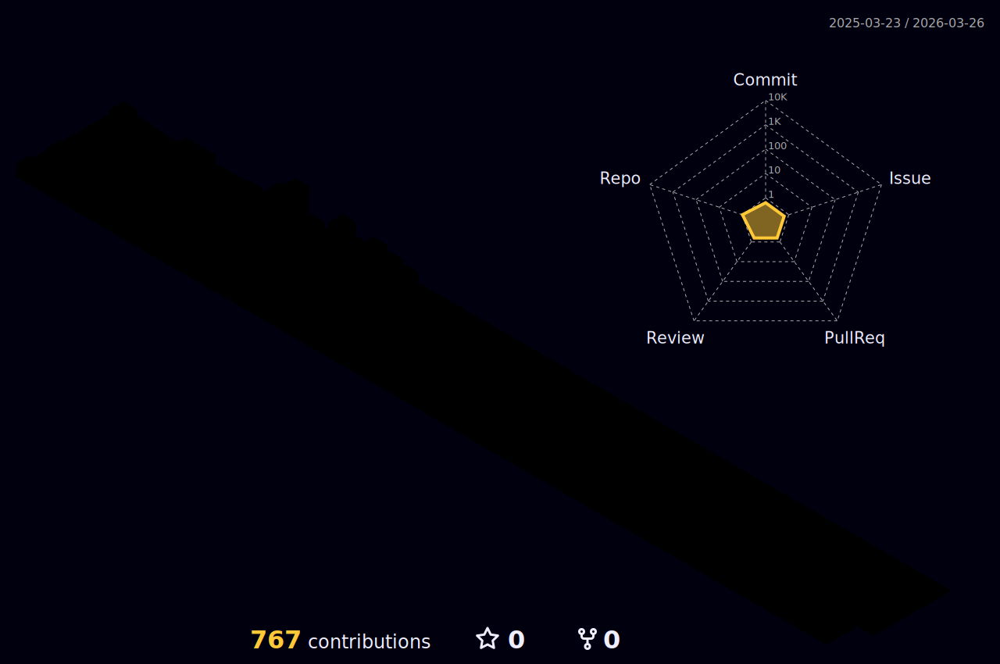

### Hi there 👋

I am Hussein Sawan, second year computer science student, passionate about software development, machine learning and artificial intelligence. In my free time, I enjoy playing practicing sport, and learning new things.

## 👨 Socials

## 🧑‍💻 Languages

## 🚀 Frameworks & Library

## 📚 Storage

## 💻 Terminals

## 💽 Operating System

## ⚡ Technologies

## 👩‍💻 IDE

## Laptop

